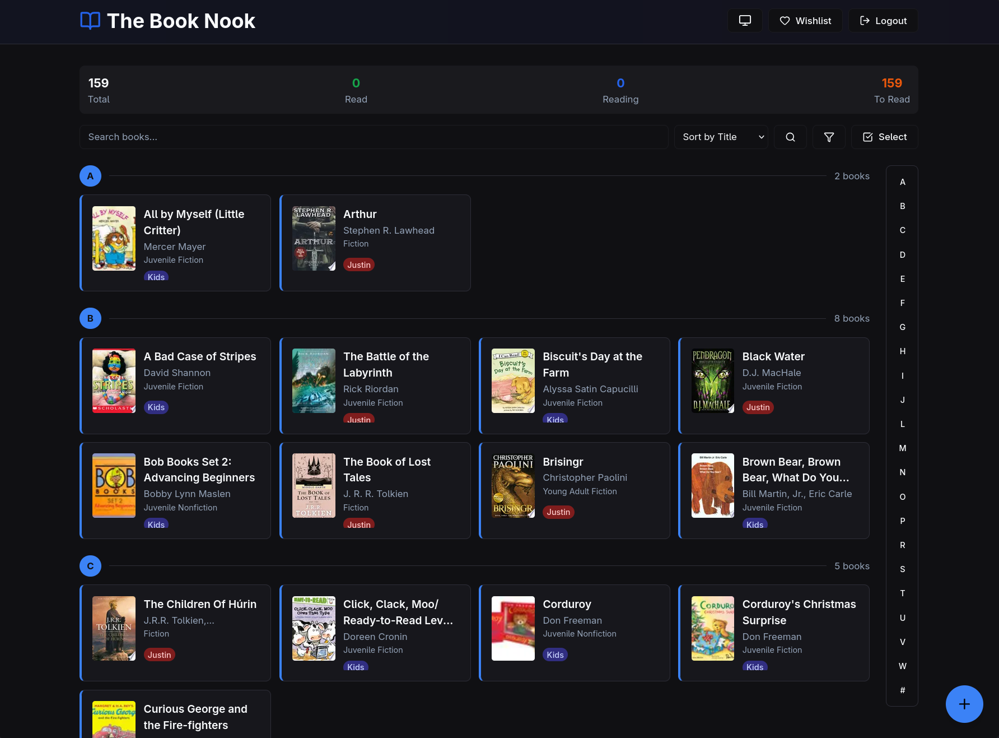

# Personal Library Catalog

A simple web application to catalog and manage your personal book collection with authentication and Docker support.



## Features

- **User Authentication**: Secure login system with username/password
- **Book Management**: Add, edit, and delete books from your library
- **Google Books Integration**: Search and import book details automatically
- **Reading Status**: Track books as unread, currently reading, or read
- **Ratings & Notes**: Add personal ratings (1-5 stars) and notes to books
- **Search & Filter**: Search your library by title, author, or ISBN
- **Statistics Dashboard**: View your reading progress and library stats
- **Docker Support**: Easy deployment with Docker Compose

## Tech Stack

- **Frontend**: Next.js 14, TypeScript, Tailwind CSS
- **Database**: SQLite with Prisma ORM
- **API**: Google Books API for book search
- **UI Components**: Custom components with Radix UI

## Getting Started

### Option 1: Docker Compose (Recommended)

1. Copy the environment file:
```bash
cp .env.example .env
```

2. Update the `.env` file with your desired credentials:
```
DEFAULT_USERNAME=admin
DEFAULT_PASSWORD=your-secure-password
JWT_SECRET=your-secret-key
```

3. Run with Docker Compose:
```bash
docker-compose up -d
```

4. Open [http://localhost:3000](http://localhost:3000) and login with your credentials

### Option 2: Local Development

1. Install dependencies:
```bash
npm install
```

2. Copy and configure environment:
```bash
cp .env.example .env
```

3. Run database migrations:
```bash
npx prisma migrate dev
```

4. Seed the database with default user:
```bash
npm run seed
```

5. Start the development server:
```bash
npm run dev
```

6. Open [http://localhost:3000](http://localhost:3000) in your browser

## Default Credentials

- **Username**: admin
- **Password**: changeme

⚠️ **Important**: Change these credentials in production!

## Usage

### Adding Books

1. Click "Add Book" from the homepage
2. Search for books using the Google Books search
3. Click "Add" to add a book to your library
4. Or use manual entry for books not found in search

### Managing Your Library

- Click on any book card to view details and edit
- Update reading status, add ratings, and personal notes
- Delete books you no longer want to track

### Database

The app uses SQLite for data storage. The database file is located at:
```
prisma/dev.db
```

## Project Structure

```
library-catalog/
├── app/                  # Next.js app directory
│   ├── api/             # API routes
│   ├── add/             # Add book page
│   ├── books/[id]/      # Book detail page
│   └── login/           # Login page
├── components/          # React components
├── lib/                 # Utility functions
├── prisma/             # Database schema
├── docker-compose.yml   # Docker Compose configuration
└── Dockerfile          # Docker image configuration
```

## Docker Commands

```bash
# Start the application
docker-compose up -d

# Stop the application
docker-compose down

# View logs
docker-compose logs -f

# Rebuild after changes
docker-compose up -d --build

# Remove volumes (reset database)
docker-compose down -v
```

## Environment Variables

| Variable | Description | Default |
|----------|-------------|---------|
| `DATABASE_URL` | SQLite database path | `file:./dev.db` |
| `JWT_SECRET` | Secret key for JWT tokens | Required in production |
| `DEFAULT_USERNAME` | Default admin username | `admin` |
| `DEFAULT_PASSWORD` | Default admin password | `changeme` |
